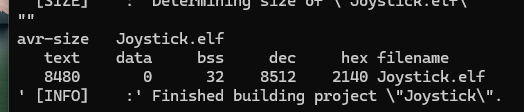
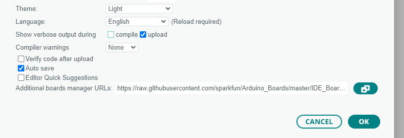
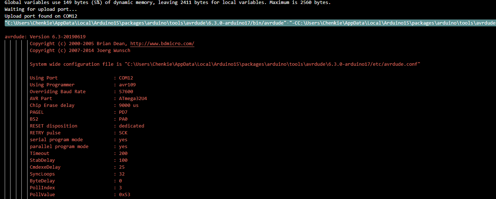
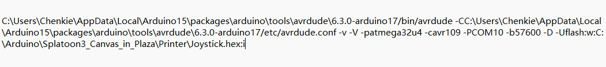
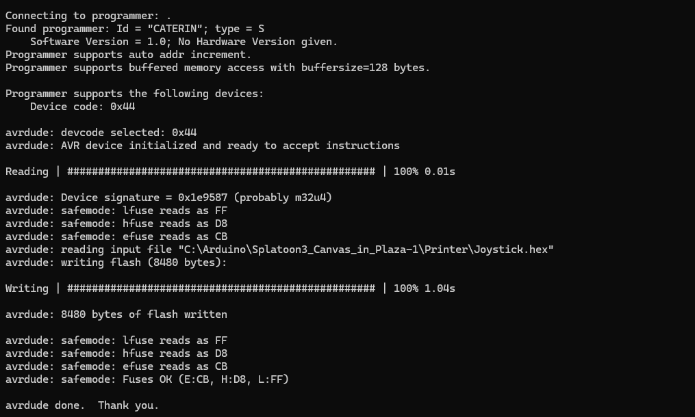
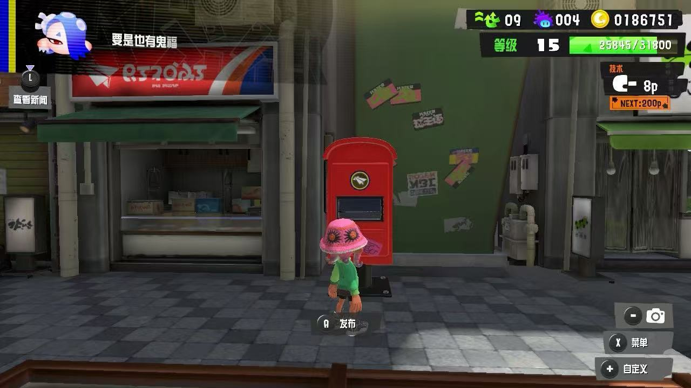
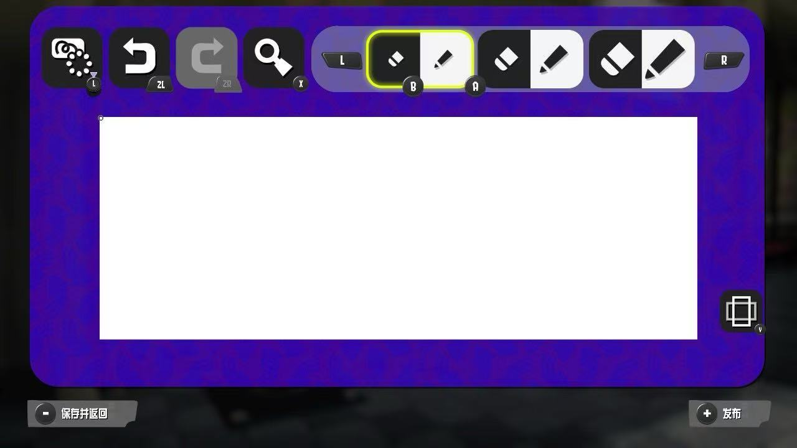
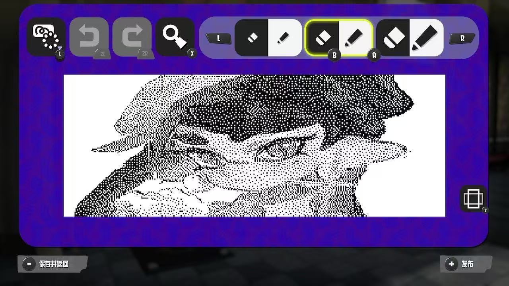

# Splatoon 3 Canvas Printer
## 1. Intro
This repo is a hardware development based on Pro Micro MCU integrated Atmega32u4 chip. 
[Splatoon3](https://en.wikipedia.org/wiki/Splatoon_3)(喷射战士 in Chinese language) or 'PenPen(喷喷) called between chinese fans, have a wonderful part for paint lover,scrawled in a blank canvas with resolution 320x120 and post for viewing by others. 
However,it's hard to draw with Nintendo Controller,even if some straight line.We can consider use a Micro control unit(MCU) replace controller and convert image you want to draw into a `.c` file and compile it into a `.hex` file,finally upload this file to your device,then connect MCU to your Nintendo Switch with data transfer line,open canvas of Spaltoon,switch will recognize your MCU as a controller,scrawl will start automatically until finish.
## 2.Device and Accessories
* [Pro Micro](https://www.sparkfun.com/products/12640)(I recommend 5v/16MHz)

* Two jumpers and a switch button,connect them as this:

* Bread Board (Depend on your type of jumpers)
* A computer with Windows OS and have install [Arduino IDE](https://support.arduino.cc/hc/en-us/articles/360019833020-Download-and-install-Arduino-IDE)
* Python 3.x interpreter have install Pillow lib. 
## 3.Step
* 1.Resize your image with resolution 320x120 in `resize.py` file of Resize folder,code `python resize.py image.jpg(.png)` in terminal upon Resize folder.
* 2.Convert your image to `.c` file in Printer folder,move your resized `.png` file to Printer folder and code `python png2c.py Resized.png` in terminal.
* 3.Configure `avrgccstart.cmd` file in Printer folder,edit with notepad format,make sure path inside correctly,this file will work for upload later.
* 4.Generate `.hex` in `.cmd`file you just edited,double tap `.cmd` file and code `make` then some files about `Joystick` will generated including `Joystick.hex` file.The following info means `.hex` file have generated.

* 5.Open Arduino IDE and connect your Pro Micro with computer,open preferences and input `https://raw.githubusercontent.com/sparkfun/Arduino_Boards/main/IDE_Board_Manager/package_sparkfun_index.json` into Additional boards manager URLs for configuration of Pro Micro device,then check upload in show verbose output during,finally click OK.

* 6.Upload `sketch_xxx.ino` to your device for reset.Notice output line in bottom terminal,copy and paste this line in a `.txt` file and edit as this:

Remember to ignore quotation marks.
* 7.Upload `.hex` file to our device,double click `.cmd ` file and input line you just edited in notepad.Before upload,click reset button twice. Then you will get such output for upload successfully.

* 8.Open Splatoon Game and find a red mail box for post your scrawl,move cursor's position at top of left with the smallest pixel ,turn off your controller and connect Pro Micro with your Switch,scrawl will begin in a few minutes.

* 9.Once finished,just pull out your Pro Micro.

I recommend this [website](https://doodad.dev/dither-me-this/) for preview your scrawl in canvas.